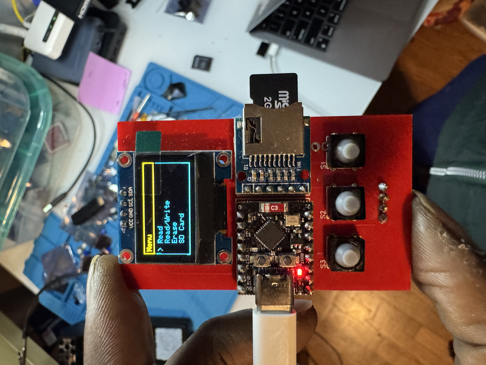
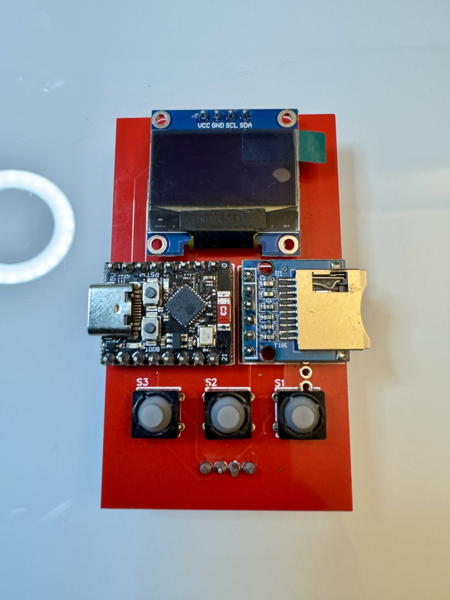
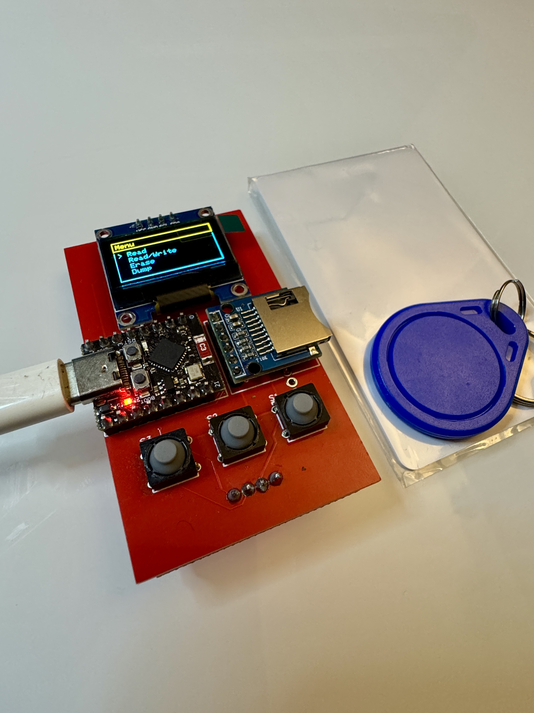
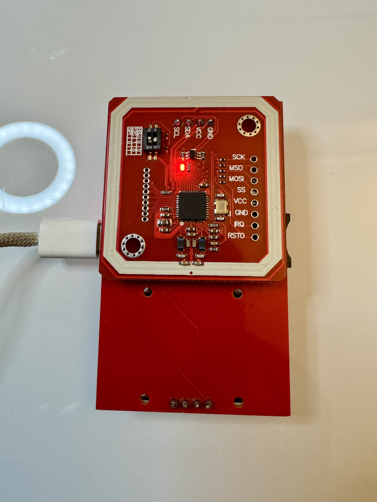
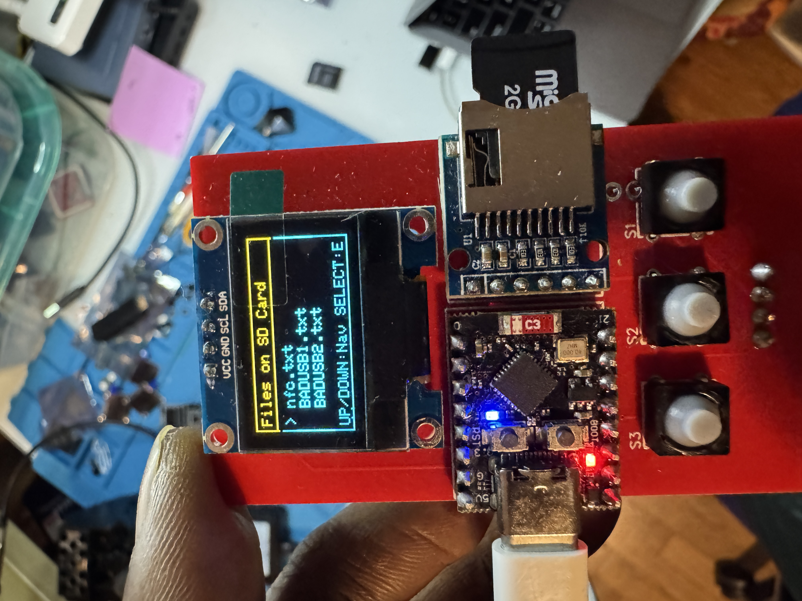
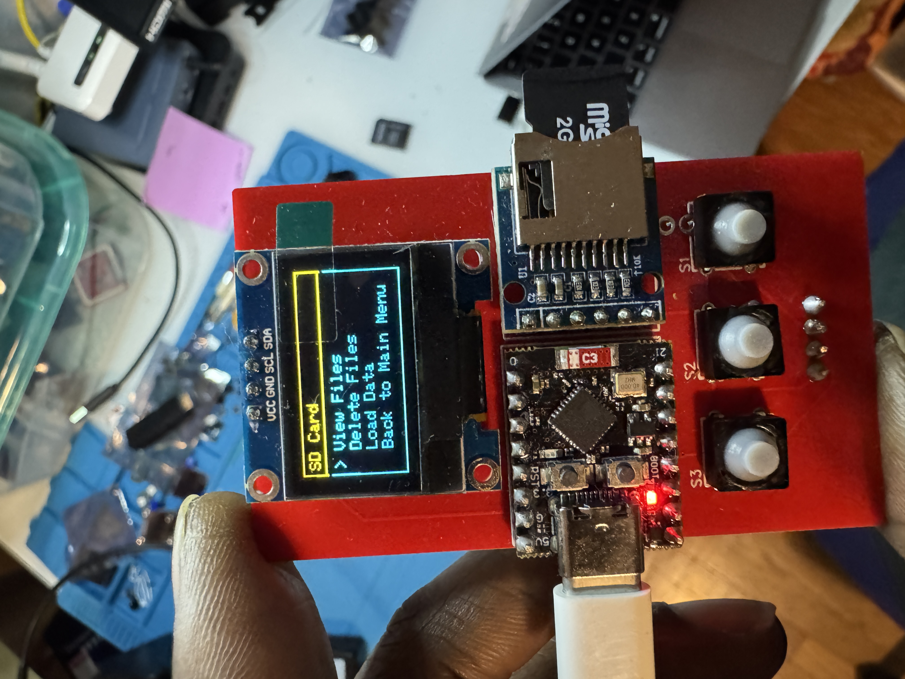
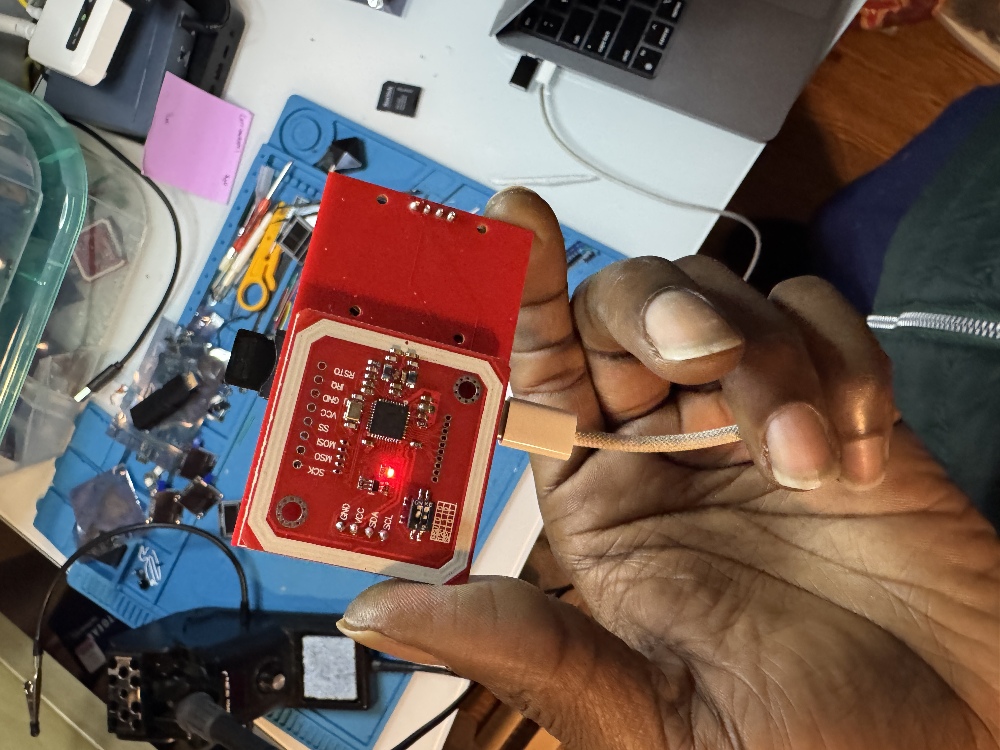

# CYPHER NFC v2.0
## Advanced ESP32-C3 NFC/RFID Device with MIFARE Cloning, Dictionary Attacks & Full Card Dumps



This project provides a comprehensive, handheld NFC/RFID toolkit built on the ESP32-C3 Super Mini with PN532 chipset. **v2.0 is a complete rewrite** featuring proper state machines, card type auto-detection, full MIFARE Classic and NTAG dumps, dictionary attacks, magic card cloning, NDEF writing, and a hex file viewer.

- **Handheld device**: ESP32-C3 Super Mini + SSD1306 128x64 OLED + SD card module + PN532 RFID/NFC + 3-button UI
- **Professional-grade NFC capabilities**: Not a toy—this is a working toolkit for NFC research, pentesting, and card forensics
- **Fully open-source**: Schematics and PCB files available; create your own via PCBWay! https://pcbway.com/g/87Pi52

## Current Features (v2.0)

### Core Scanning
- **Scan & Info**: Automatic card type detection (MIFARE Classic 1K/4K, NTAG213/215/216, Ultralight). Displays UID, card type, and capacity.

### Read Operations
- **UID Only**: Quick card UID capture
- **Read NDEF**: Extract and display NDEF-formatted messages from NTAG cards
- **Full MIFARE Dump**: Complete 1K or 4K block dump with automatic key discovery via 50-key dictionary attack. Outputs binary (`.mfd`) + text (`.txt`) files to SD card.
- **Full NTAG Dump**: All pages (45–231 depending on model). Outputs binary (`.bin`) + text (`.txt`) to SD card.

### Key Recovery & Attacks
- **Dictionary Attack**: Test 50 common MIFARE Classic keys (factory defaults, transport, access control) against all sectors. Displays per-sector cracked status (sector key map grid).

### Cloning
- **Dump to SD**: Scan source card → full dump with key discovery → save to SD.
- **SD to Magic Card**: Select saved dump → place magic card → clone all blocks from dump → handles sector trailers and access bits.
- **Verify Clone**: Block-by-block comparison of cloned card against source dump. Reports exact mismatch count.

### Writing
- **Write NDEF URL**: Write `http://`, `https://`, `http://www.`, or `https://www.` URLs to NTAG cards.
- **Write NDEF Text**: Write language-tagged text to NTAG cards.
- **Write from SD**: (Placeholder for future expansion)

### SD Card Tools
- **Browse Files**: Navigate SD card directory (displays via scrolling list).
- **Hex View File**: Open any file → navigate with UP/DOWN buttons → view 16-byte rows with hex + ASCII columns.
- **Delete File**: Remove files from SD card.

### Supporting Features
- **Unique file naming**: Persistent `/COUNTER.TXT` on SD auto-increments filenames (`dmp001.mfd`, `dmp002.mfd`, `ntg001.bin`, etc.)
- **Progress feedback**: Long operations (dumps, dictionary attacks) show real-time progress bars
- **Card type auto-detection**: Identifies MIFARE Classic vs NTAG variants via UID length and capability container inspection

## Menu Structure

The device uses a 6-item main menu with context-sensitive submenus:

```
MAIN MENU
├─ Scan & Info              → Auto-detect + display card info
├─ Read Card
│  ├─ UID Only
│  ├─ Read NDEF
│  ├─ Full Dump MIFARE      → Auto key discovery + save
│  ├─ Full Dump NTAG        → All pages + save
│  └─ Back
├─ Key Attack
│  ├─ Dictionary Attack     → 50 keys × all sectors
│  └─ Back
├─ Clone Card
│  ├─ Dump to SD            → Scan source + dump
│  ├─ SD to Magic Card      → Select file + clone
│  ├─ Verify Clone          → Block-by-block check
│  └─ Back
├─ Write Card
│  ├─ Write NDEF URL        → Select URL prefix + write
│  ├─ Write NDEF Text       → Select text + write
│  ├─ Write from SD         → (Reserved for future)
│  └─ Back
└─ SD Card
   ├─ Browse Files          → Navigate + view filenames
   ├─ Hex View File         → Open + scroll hex+ASCII
   ├─ Delete File           → Select + confirm delete
   └─ Back
```

**Navigation:** UP/DOWN buttons scroll menu items. SELECT button chooses item or confirms action. "Back" item returns to previous menu.

## Building & Flashing

### Requirements
- **Arduino IDE 2.x** (https://www.arduino.cc/en/software)
- **ESP32 Board Support** installed (via Arduino IDE → Boards Manager, search "esp32", install latest)
- **Required Libraries**:
  - `Adafruit_PN532` (via Arduino IDE → Library Manager)
  - `Adafruit_SSD1306` (via Arduino IDE → Library Manager)
  - `Adafruit_BusIO` (dependency for Adafruit libs)

### Build Steps

1. **Clone or download** this repository
2. **Install libraries** via Arduino IDE Library Manager (Sketch → Include Library → Manage Libraries)
3. **Select board**: Tools → Board → ESP32 Arduino → **XIAO_ESP32C3**
4. **Set upload speed**: Tools → Upload Speed → 115200
5. **Connect ESP32-C3** via USB cable to your computer
6. **Select port**: Tools → Port → (your USB port)
7. **Open** `cypher_pn532/cypher_pn532.ino` in Arduino IDE
8. **Compile**: Sketch → Verify
9. **Flash**: Sketch → Upload
10. **Monitor** (optional): Tools → Serial Monitor (set to 115200 baud)

### On First Boot
- Device will initialize PN532 module and SD card
- Display will show "Cypher NFC v2.0" splash screen
- Main menu loads automatically

## SD Card File Formats

All dumps saved to SD card root directory with auto-incremented counters.

| File Type | Extension | Format | Notes |
|-----------|-----------|--------|-------|
| MIFARE Dump (Binary) | `.mfd` | Raw 1024 (1K) or 4096 (4K) bytes | Backup/restore format |
| MIFARE Dump (Text) | `.txt` | Hex sector headers + per-block hex/ASCII | Human-readable reference |
| NTAG Dump (Binary) | `.bin` | Raw pages (45–231 pages × 4 bytes) | Backup/restore format |
| NTAG Dump (Text) | `.txt` | Hex page headers + hex/ASCII | Human-readable reference |
| Counter | `COUNTER.TXT` | Plain text number | Auto-managed; do not edit |

**Example filenames:**
- `dmp001.mfd` / `dmp001.txt` — First MIFARE dump (1K or 4K, files paired)
- `dmp002.mfd` / `dmp002.txt` — Second MIFARE dump
- `ntg001.bin` / `ntg001.txt` — First NTAG dump
- `COUNTER.TXT` — Current counter value (managed automatically)

## Parts List

| Component                     | Description                                      |
|-------------------------------|--------------------------------------------------|
| **ESP32-C3 Super Mini**       | Microcontroller with Wi-Fi and Bluetooth support |
| **SSD1306 128x64 OLED Display** | .96-inch screen for displaying information      |
| **SD Card Module**            | Module for reading and writing SD cards         |
| **PN532 RFID/NFC Module**     | Module for RFID/NFC reading and writing         |
| **Push Buttons**              | 3 buttons for user interaction                   |
| **Resistors**                 | 10kΩ resistors (optional)         |
| **Breadboard**                | For prototyping connections                       |
| **Jumper Wires**              | For making connections between components        |
| **3V Power Supply**              | Suitable power source for the ESP32             |

## Parts used to make this device:
- **ESP32-C3 Super Mini**:
https://amzn.to/3XtgL9G

- **PN532 NFC/RFID Module**:
https://amzn.to/3XqYQjN

- **SSD1306 128x64 Screen**:
https://amzn.to/3TqELJe

- **SD Card Module**:
https://amzn.to/3zsvJot

- **Tactile Buttons**:
https://amzn.to/4gripRD

## Hardware & Wiring

### PN532 NFC/RFID Module (I2C)
- **SDA**: GPIO 8
- **SCL**: GPIO 9
- **IRQ**: GPIO 2 (optional, handled in code)
- **RESET**: GPIO 3 (hardware wire, do not change)

### SD Card Module (SPI)
- **CS**: GPIO 10
- **MOSI**: GPIO 6
- **MISO**: GPIO 5
- **SCK**: GPIO 4

### User Interface Buttons
- **UP** (BUTTON_UP): GPIO 7 ⚠️ **(Hardware Change v2.0: was GPIO 3, conflicted with PN532_RESET)**
- **DOWN** (BUTTON_DOWN): GPIO 1
- **SELECT** (BUTTON_SELECT): GPIO 0 ⚠️ **(Hardware Change v2.0: was GPIO 2, conflicted with PN532_IRQ)**

### SSD1306 OLED Display (I2C)
- Shares I2C bus with PN532 (GPIO 8/9)
- Default address: 0x3C

### ⚠️ Critical Hardware Rewiring Required

**If upgrading from v1.x, you MUST physically rewire the buttons:**
1. Disconnect BUTTON_UP from GPIO 3 and reconnect to GPIO 7
2. Disconnect BUTTON_SELECT from GPIO 2 and reconnect to GPIO 0
3. Verify all connections before powering on

Failure to rewire will cause conflicts with the PN532 hardware pins.

## Technical Features (Under the Hood)

### Card Type Auto-Detection
- **MIFARE Classic 1K vs 4K**: Detected via UID length (4 bytes) + block 128 probing
- **NTAG vs Ultralight**: Detected via capability container byte at page 3 (CC field)
- **Full type support**: MIFARE Classic, NTAG213/215/216, MIFARE Ultralight, ISO14443-4

### Dictionary Attack Algorithm
- Embeds 50 most common MIFARE keys (factory defaults, transport, vendor keys)
- Tests Key A + Key B per sector (~64 keys × 32 sectors for 1K = ~2000 auth attempts)
- Shows live per-sector progress; completes ~30 seconds for typical 1K card
- Caches discovered keys for efficient block reading

### Magic Card Detection & Cloning
- Non-destructive magic card test: attempts backdoor auth on block 0
- Supports Gen1a magic cards (UID-writable via InDataExchange)
- Block 0 clone via raw `0xA0` write command; sectors 1+ via standard auth + write
- Sector trailer (access bits) handled separately to avoid locking card

### Full Dumps
- **MIFARE**: All 64 (1K) or 256 (4K) blocks captured with key recovery
- **NTAG**: All 45–231 pages depending on model; pages 42+ read via raw InDataExchange (0x30 command)
- Both output binary + human-readable text formats

### State Machine Architecture
- `AppState` enum replacing ad-hoc boolean flags
- Each menu context owns its own item list and navigation state
- Clean dispatch pattern from menu selection to operation execution

### Memory-Efficient Design
- ~28 KB total RAM footprint (safe on ESP32-C3 with 400 KB)
- Global dump buffers (MifareDump, NTAGDump) reused across multiple operations
- Serial I/O async-friendly (no infinite polling loops)

## Compatibility & Limitations

- **Supported cards**: ISO14443A (Type 2 & Type 4) — MIFARE, NTAG, Ultralight
- **Not supported**: HF ISO14443B, ISO15693, FeliCa, other 13.56MHz standards
- **Magic card cloning**: Only Gen1a backdoor method; Gen2/CUID requires alternate approach (not implemented)
- **NDEF writing**: URL/Text only; nested NDEF messages not supported
- **Encryption**: MIFARE DES/3DES authentication is symmetric (no real encryption); key recovery is the point

## Troubleshooting

| Issue | Solution |
|-------|----------|
| **OLED display is blank** | Check I2C wiring (GPIO 8/9); verify address is 0x3C via Arduino IDE I2C scanner |
| **PN532 not detected** | Check I2C wiring; ensure GPIO 8/9 are not in use by other hardware; try power-cycling |
| **SD card not found** | Check SPI wiring (GPIO 4/5/6/10); ensure card is FAT32 formatted; try reinserting card |
| **Button not responding** | Check GPIO wiring; verify pullup resistors (10kΩ recommended on all three buttons) |
| **Dictionary attack fails** | Ensure MIFARE Classic card (not Plus/Pro/EV1); some vendor keys may be missing from 50-key list |
| **Watchdog reset during dump** | Normal on heavily protected sectors; card is still safe; try reducing SPI clock (in code) |
| **Cannot detect card type** | Card may be unsupported (HF ISO14443B, ISO15693, etc.); or PN532 antenna needs adjustment |

## Development and Updates

v2.0 represents a complete architectural rewrite from the proof-of-concept v1.0. All code is open-source; contributions welcome. See `CLAUDE.md` for development notes, architecture details, and known technical debt.

Key improvements in v2.0:
- Fixed 8 critical bugs from v1.0 (pin conflicts, infinite loops, broken file naming, uninitialized variables)
- Removed ~300 lines of dead code
- Implemented proper state machine for menu navigation
- Added card type auto-detection with blockage-friendly key discovery
- Full MIFARE/NTAG dump with binary + text export
- Magic card cloning with Gen1a backdoor support
- NDEF URL/text writing with TLV format
- Hex file viewer for SD card inspection
- Progress feedback for all long-running operations









